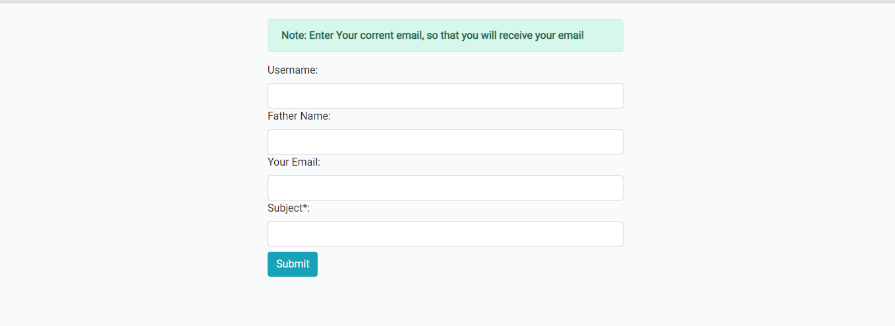

# Email Sending With Django 

This is the Email Sending App using [Django](https://www.djangoproject.com/), Which sends your desired message to your given Email.

### Introduction

Simple Design with flexible backend code with Django, sends Email after hiting submit button you would receive your message through given Email Address.

### Features:
* Responsive User Interface 
* Reponsive Form
* Simple [Bootstrap](https://getbootstrap.com/docs/5.2/) 5.2 Design
* [SQL Lite3](https://www.sqlite.org/index.html) Database (Default Database of [Django](https://www.djangoproject.com/))

## Site Look

### This shows home page of site, that's how our desing is simple but responsive.

### How to use after installing?

* First Download it and install `Virtual Environment` in it using `pip install virtualenv`
* Install [Django](https://www.djangoproject.com/) in `Virtual Environment` using `pip install Django`
* Run it using `python manage.py ruserver`
* That's how our project works

### What's New while using Email with Django?

Here are some includes which you should include in your main `setting.py` file before working on it.

#### Add below code to your main `setting.py` file

*  `EMAIL_BACKEND = 'django.core.mail.backends.smtp.EmailBackend'` in the bottom of your main `settings.py` file
*  `EMAIL_HOST = 'smtp.gmail.com'` also
* `EMAIL_USE_TLS = True`
* `EMAIL_PORT = 587`
* `EMAIL_HOST_USER = 'Your Email'`
* `EMAIL_HOST_PASSWORD = 'Your Gmail App Password'`

After setting all this , Now our next step is to send Email using `views`

### In Your views, add this line to send Email

        * `send_mail(subject,message,email_from,recipient_list)`
* `Subject`         => Heading of your message
* `message`         => Actual Message
* `email_from`      => `settings.EMAIL_HOST_USER` 
* `recipient_list`  => `To Email`

